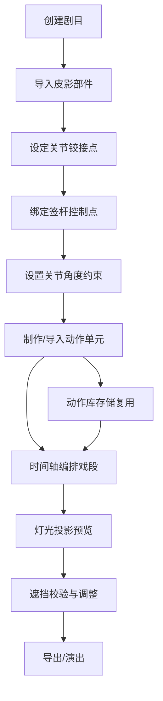

## 1. 产品概述

皮影戏动作编排生产力系统是一款面向皮影戏制作演出的专业工具，提供皮影人物骨架绑定、关节约束、动作编排与剧目管理的全流程数字化解决方案。通过可视化的骨骼绑定和物理约束计算，大幅提升皮影戏动作设计效率，实现高质量的皮影动画效果。

- 核心目标：将传统皮影戏制作流程数字化，提供专业级的骨架绑定、动作编排和剧目管理工具
- 目标用户：皮影戏艺人、动画师、非遗传承工作者、影视制作团队
- 产品价值：降低皮影戏动作设计门槛，提升制作效率，保护和传承非遗文化

## 2. 核心功能

### 2.1 用户角色

| 角色 | 使用场景 | 核心权限 |
|------|----------|----------|
| 皮影戏艺人 | 传统皮影戏数字化编排演出 | 全部功能，创建和管理剧目 |
| 动画师 | 皮影风格动画制作 | 动作编排、效果预览 |
| 非遗工作者 | 皮影戏资料整理保存 | 剧目管理、动作库归档 |

### 2.2 功能模块

1. **部件绑定页**：导入皮影部件轮廓、设定关节铰接点、绑定签杆控制点
2. **关节约束页**：关节角度约束设置、反向折断检测、活动范围告警
3. **动作编排页**：时间轴编辑、动作单元串联、流畅度模拟
4. **动作库页**：基本身段识别、动作单元管理、复用与导出
5. **剧目管理页**：剧目归类、影人与动作关联、项目级管理

### 2.3 页面详情

| 页面名称 | 模块名称 | 功能描述 |
|-----------|-------------|---------------------|
| 部件绑定页 | 部件导入 | 支持SVG/图片导入皮影各部件轮廓，分层管理 |
| 部件绑定页 | 关节绑定 | 可视化设定头、颈、臂、腿等关节铰接点位置 |
| 部件绑定页 | 签杆绑定 | 按人物造型绑定多签杆的操纵控制点 |
| 部件绑定页 | 预览画布 | 实时预览绑定效果，支持拖动调整 |
| 关节约束页 | 角度约束 | 设置各关节的活动角度范围（最小/最大角度） |
| 关节约束页 | 联动计算 | 计算关节联动关系，模拟父子关节联动效果 |
| 关节约束页 | 反向检测 | 实时检测肢体反向折断风险，高亮告警 |
| 关节约束页 | 约束测试 | 拖动测试关节活动，验证约束合理性 |
| 动作编排页 | 时间轴 | 多轨道时间轴，支持关键帧编辑和插值 |
| 动作编排页 | 动作单元 | 从动作库拖入动作单元，自动拼接过渡 |
| 动作编排页 | 灯光模拟 | 模拟灯光投影效果，边缘虚实调节 |
| 动作编排页 | 遮挡校验 | 签杆交叉时自动计算遮挡顺序，保证投影清晰 |
| 动作库页 | 基本身段 | 走路、抱拳、作揖等预设基本身段动作 |
| 动作库页 | 动作管理 | 创建、编辑、删除动作单元，分类管理 |
| 动作库页 | 动作识别 | 自动识别关键帧序列中的常见身段 |
| 动作库页 | 预览播放 | 单个动作单元的循环预览和参数调节 |
| 剧目管理页 | 剧目列表 | 按剧目归类管理影人和动作资源 |
| 剧目管理页 | 角色管理 | 剧目中的角色管理，关联动作库 |
| 剧目管理页 | 资源概览 | 剧目资源统计和快速入口 |

## 3. 核心流程

### 主要工作流程

用户从创建剧目开始，依次完成皮影部件绑定、关节约束设置、动作单元制作，最终在时间轴上编排成完整的戏段。每个步骤的成果都可以保存复用，形成可积累的动作库资产。

## 4. 用户界面设计

### 4.1 设计风格

- **主色调**：暖红色系（#B8350D）搭配米黄色背景（#F5E6D0），致敬传统皮影戏的暖光氛围
- **辅助色**：深棕色（#3D2914）用于文字和边框，金色（#C9A227）用于高亮和强调
- **按钮风格**：圆角矩形按钮，带有微妙的木纹质感，悬停时有暖色光晕效果
- **字体**：标题使用具有东方韵味的衬线字体，正文使用清晰易读的无衬线字体
- **布局风格**：左右分栏布局，左侧为工具面板，中间为画布预览，右侧为属性面板
- **视觉元素**：融入皮影剪影、纸质纹理、暖光投影等视觉元素，营造传统与现代融合的氛围

### 4.2 页面设计概览

| 页面名称 | 模块名称 | UI元素 |
|-----------|-------------|----------|
| 部件绑定页 | 画布区 | 大尺寸SVG画布，皮影部件分层显示，可拖拽关节点 |
| 部件绑定页 | 左侧面板 | 部件列表、图层管理、导入按钮 |
| 部件绑定页 | 右侧面板 | 选中部件属性、关节点参数、签杆设置 |
| 关节约束页 | 约束画布 | 关节角度范围可视化显示（扇形区域） |
| 关节约束页 | 约束列表 | 各关节约束参数滑块，联动关系设置 |
| 关节约束页 | 告警面板 | 实时显示超出约束的关节警告 |
| 动作编排页 | 时间轴 | 多轨道时间轴，关键帧标记，缩放控制 |
| 动作编排页 | 预览区 | 动画播放画布，灯光效果，播放控制 |
| 动作编排页 | 工具箱 | 动作单元库、过渡效果、工具按钮 |
| 动作库页 | 动作网格 | 卡片式动作单元展示，分类标签 |
| 动作库页 | 预览弹窗 | 动作循环预览，参数调节面板 |
| 剧目管理页 | 剧目卡片 | 网格布局的剧目卡片，显示缩略图和统计 |
| 剧目管理页 | 详情面板 | 剧目详情，角色列表，动作统计 |

### 4.3 响应式设计

- **桌面优先**：以桌面端为主要设计目标，充分利用大屏幕空间展示多面板布局
- **平板适配**：支持平板横屏使用，画布自适应缩放，面板可折叠
- **触摸优化**：关节点和关键帧等可交互元素提供足够的触摸热区

### 4.4 交互动效

- 关节点拖动时有磁吸效果和视觉反馈
- 时间轴操作流畅，关键帧拖动用缓动曲线
- 页面切换有淡入淡出过渡
- 告警提示有呼吸灯闪烁效果
- 播放按钮等有按压反馈动画
