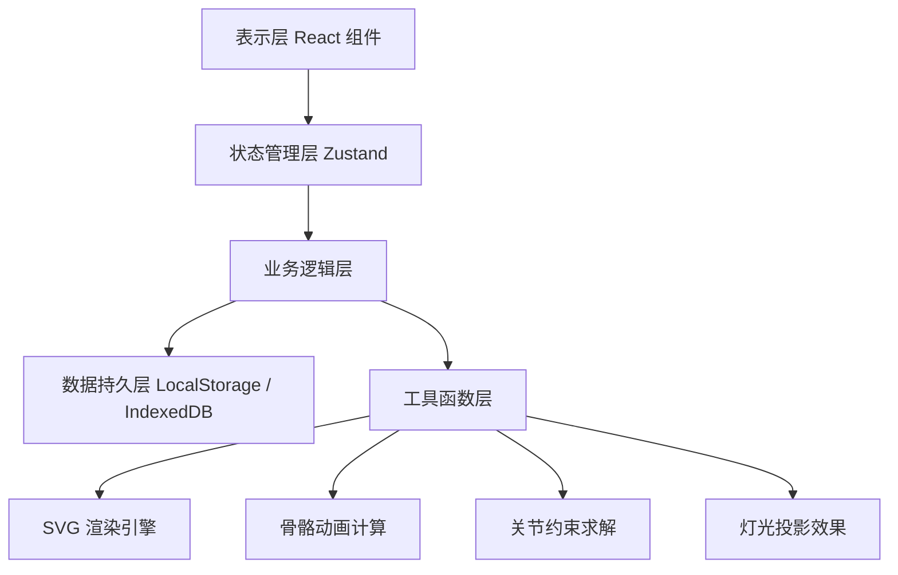
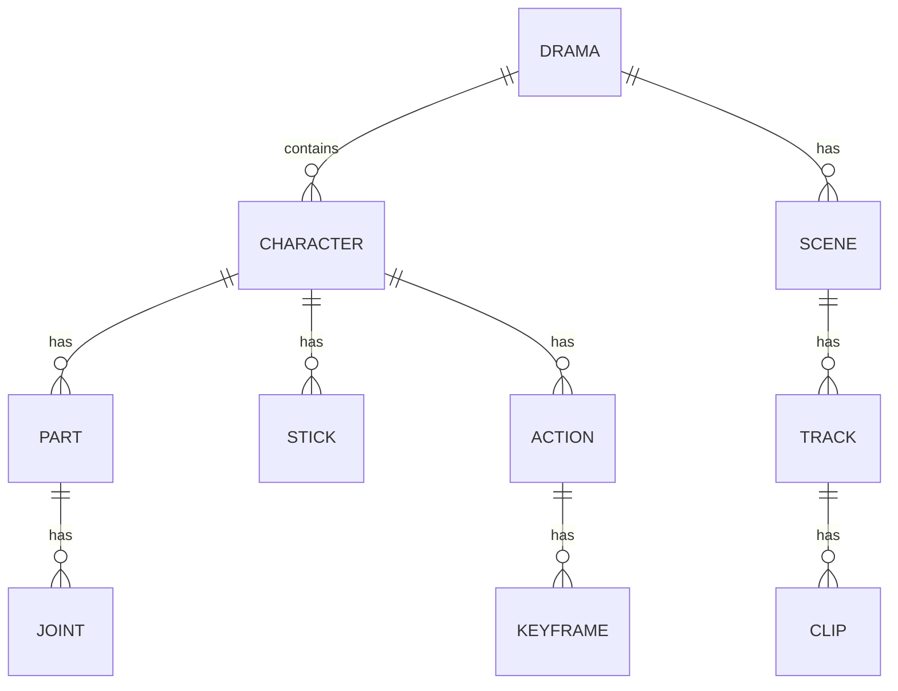

## 1. 架构设计

本项目采用纯前端单页应用架构，所有数据存储在浏览器本地（LocalStorage + IndexedDB），无需后端服务即可完整运行。使用React组件化开发，Zustand管理全局状态，SVG实现皮影画布渲染。



## 2. 技术描述

- **前端框架**：React@18 + TypeScript
- **构建工具**：Vite
- **样式方案**：TailwindCSS@3
- **状态管理**：Zustand
- **路由管理**：react-router-dom
- **图标库**：lucide-react
- **SVG渲染**：原生 SVG + 自定义动画引擎
- **数据存储**：LocalStorage（配置）+ IndexedDB（动作数据）

## 3. 路由定义

| 路由 | 页面 | 功能 |
|-------|------|------|
| / | 剧目管理页 | 剧目列表、项目总览 |
| /binding | 部件绑定页 | 皮影部件导入、关节绑定、签杆设置 |
| /constraints | 关节约束页 | 角度约束、反向检测、约束测试 |
| /timeline | 动作编排页 | 时间轴编辑、动作串联、灯光预览 |
| /library | 动作库页 | 动作单元管理、基本身段、预览播放 |

## 4. 数据模型

### 4.1 数据实体关系



### 4.2 核心数据结构定义

```typescript
// 剧目
interface Drama {
  id: string;
  name: string;
  description: string;
  cover: string; // base64 or svg
  createdAt: number;
  updatedAt: number;
  characters: Character[];
  scenes: Scene[];
}

// 皮影角色
interface Character {
  id: string;
  name: string;
  parts: Part[];
  joints: Joint[];
  sticks: Stick[];
}

// 部件
interface Part {
  id: string;
  name: string;
  type: 'head' | 'body' | 'arm_upper' | 'arm_lower' | 'leg_upper' | 'leg_lower' | 'other';
  svgPath: string;
  transform: Transform;
  parentJointId?: string;
  childJointId?: string;
  zIndex: number;
}

// 关节
interface Joint {
  id: string;
  name: string;
  partId: string;
  position: Point;
  parentId?: string;
  childId?: string;
  constraints: JointConstraints;
}

// 关节约束
interface JointConstraints {
  minAngle: number;
  maxAngle: number;
  locked: boolean;
  reverseAllowed: boolean;
}

// 签杆
interface Stick {
  id: string;
  name: string;
  controlPoint: Point;
  targetJointId: string;
  length: number;
  angle: number;
  zIndex: number;
}

// 动作单元
interface Action {
  id: string;
  name: string;
  category: string;
  characterId: string;
  duration: number;
  keyframes: Keyframe[];
}

// 关键帧
interface Keyframe {
  id: string;
  time: number;
  joints: Record<string, JointState>;
  sticks: Record<string, StickState>;
}

// 场景/戏段
interface Scene {
  id: string;
  name: string;
  duration: number;
  tracks: Track[];
}

// 轨道
interface Track {
  id: string;
  characterId: string;
  clips: Clip[];
}

// 动作片段
interface Clip {
  id: string;
  actionId: string;
  startTime: number;
  duration: number;
  speed: number;
}
```

## 5. 核心模块设计

### 5.1 骨骼动画系统

- 正向运动学：根据关节角度计算各部件位置
- 反向运动学：根据签杆控制点反推关节角度
- 约束求解：在运动计算中应用关节角度约束
- 平滑插值：关键帧之间使用贝塞尔曲线插值

### 5.2 灯光投影系统

- 边缘模糊：使用 SVG filter 模拟投影边缘虚实
- 灯光位置：可调节光源位置，影响投影角度和大小
- 遮挡计算：签杆交叉时的z-index排序和透明度过渡
- 纸张质感：叠加纹理模拟皮影幕布效果

### 5.3 时间轴编辑系统

- 多轨道支持：每个角色一条独立轨道
- 关键帧编辑：添加、删除、移动关键帧
- 动作拼接：动作单元自动对齐和过渡
- 缩放控制：时间轴缩放和平移

## 6. 项目结构

```
src/
├── components/          # 公共组件
│   ├── layout/         # 布局组件
│   ├── canvas/         # 画布组件
│   ├── timeline/       # 时间轴组件
│   └── ui/             # 通用UI组件
├── pages/              # 页面组件
│   ├── DramaManagement/
│   ├── PartBinding/
│   ├── JointConstraints/
│   ├── ActionTimeline/
│   └── ActionLibrary/
├── store/              # 状态管理
│   ├── useDramaStore.ts
│   ├── useCharacterStore.ts
│   └── useTimelineStore.ts
├── utils/              # 工具函数
│   ├── kinematics.ts   # 运动学计算
│   ├── svg.ts          # SVG操作
│   ├── animation.ts    # 动画相关
│   └── constraints.ts  # 约束求解
├── types/              # 类型定义
│   └── index.ts
├── hooks/              # 自定义hooks
├── App.tsx
└── main.tsx
```

## 7. 性能优化

- SVG 渲染优化：使用 transform 而非重绘
- 动画帧管理：requestAnimationFrame 统一调度
- 状态选择器：Zustand 按需选择，避免不必要重渲染
- 大数据存储：IndexedDB 存储动作数据，LocalStorage 存储配置
